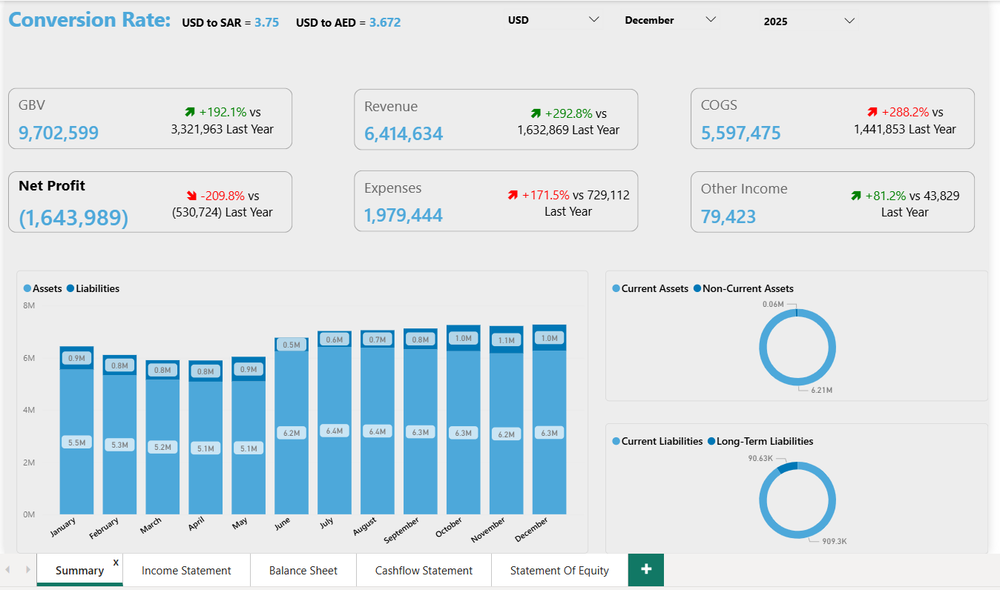
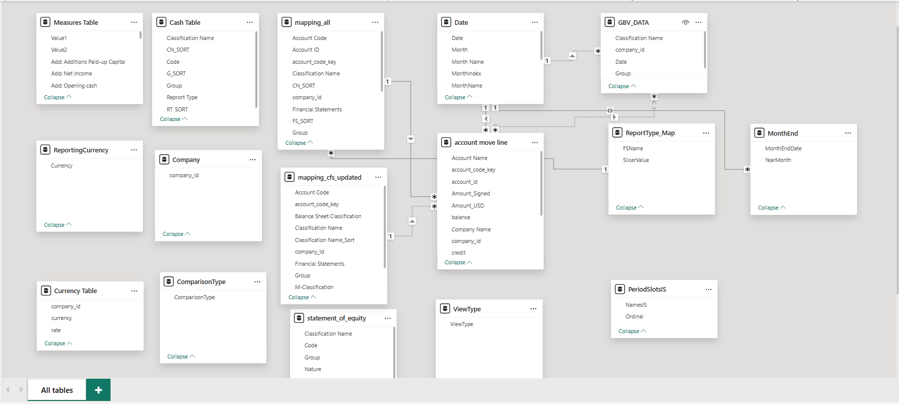

# Financial Statements Dashboard (Power BI)

## Business Context
This dashboard provides a consolidated financial view for management to analyze
company performance across the Income Statement, Balance Sheet, Cash Flow Statement,
and Statement of Equity.

It is designed for monthly and yearly reviews, variance analysis, and executive reporting.

## Key KPIs & Metrics
- Gross Booked Value (GBV)
- Revenue
- Cost of Goods Sold (COGS)
- Net Profit
- Operating Expenses
- Other Income
- Total Assets vs Total Liabilities

## Analysis Features
- Month and Year slicer–driven reporting
- YTD, YoY, and MoM variance analysis
- Dynamic currency selection
- Clear separation of current vs non-current balances
- Executive-ready summary layout

## Data Model
- Central Date table
- Fact tables for financial transactions
- Star schema design
- Time intelligence implemented using DAX

## Tools & Skills Demonstrated
- Power BI
- DAX (time intelligence and variance logic)
- Financial reporting concepts
- Data modeling best practices
## Dashboard Preview
Screenshots below illustrate the dashboard structure and insights.
## Dashboard Summary

## Detailed Financial Statements

## Data Model

